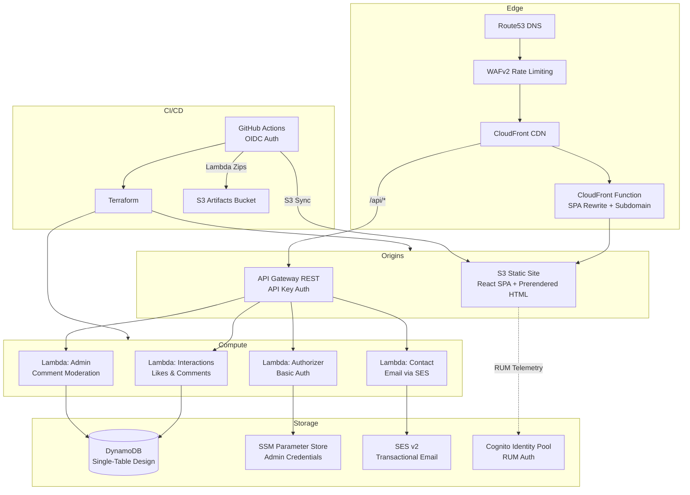

# Hi, I'm Jonathan 👋

I'm a senior software developer with **~10 years of experience** spanning backend engineering, cloud‑native
infrastructure, and DevOps automation. I love turning complex problems into elegant, reliable systems — and learning
something new every day.

---

## 🛠️ Tech Stack & Interests

| Domain                 | Tools & Languages                                                  |
|------------------------|--------------------------------------------------------------------|
| **Languages**          | Java, Python, C/C++, JavaScript/TypeScript, Go                     |
| **Cloud / DevOps**     | AWS, Kubernetes (K3s & EKS), Terraform, Flux CD, Ansible           |
| **Observability**      | Prometheus, Grafana, Loki                                          |
| **Networking & Infra** | Proxmox, OPNsense, MetalLB, Traefik, BIND9                        |
| **Data**               | DynamoDB, PostgreSQL, Redis                                        |
| **Learning**           | Algorithms & Data Structures, System Design, Low‑Level Programming |

---

## 🌐 jyates.dev Architecture

My portfolio site is a fully serverless application on AWS, deployed via GitHub Actions with OIDC — no static credentials.

**Key design decisions:**
- **SPA with prerendering** — React Router 7 generates static HTML at build time for SEO; client-side navigation after hydration
- **Single-table DynamoDB** — likes, comments, and moderation state in one table with composite keys
- **CloudFront error handling** — only 404 triggers SPA fallback (not 403), so API error responses pass through correctly
- **IP deduplication** — extracts first IP from `X-Forwarded-For` chain for like toggle tracking

Three public repositories: [`jyatesdotdev-frontend`](https://github.com/jyatesdotdev/jyatesdotdev-frontend) (React SPA), [`jyatesdotdev-api`](https://github.com/jyatesdotdev/jyatesdotdev-api) (Go Lambdas), [`jyatesdotdev-infra`](https://github.com/jyatesdotdev/jyatesdotdev-infra) (Terraform). A private bootstrap repo manages account-level resources (OIDC provider, deploy role, state/artifacts buckets).

---

## 🚀 What I'm Working On

### `Rune` — a tiny interpreted language

An interpreter written in **C** to teach myself data structures and algorithms from the ground up — syntax inspired by
Python, with an interactive REPL and AST visualizer.

### Home‑Lab GitOps

Terraform + Flux CD modules that provision and continuously reconcile a self‑hosted **K3s** cluster (Traefik ingress,
MetalLB, external‑dns, BIND9, DHCP, VLAN segmentation, and more).

### Algorithm Visualizers

Interactive maze/graph explorers (DFS/BFS, Manhattan distance tweaks) built with Python + JavaScript to make algorithm
study tactile and fun.

---

## 📚 Learning & Sharing

I document my journey — successes **and** face‑plants — through blog posts, code comments, and discussions. Current
deep‑dives include:

- Distributed systems & consensus primitives (Raft, TO‑Bcast)
- Performance tuning for JVM & Go micro‑services
- Spaced‑repetition workflows for continuous learning

---

## 🌱 Open to Collaborate

I'm always excited to chat about infrastructure, dev tooling, and projects that **make an impact**. Feel free to open an
issue, start a discussion, or just say hi.

---

> *"Spot the bottleneck, learn fast, ship the fix."*
