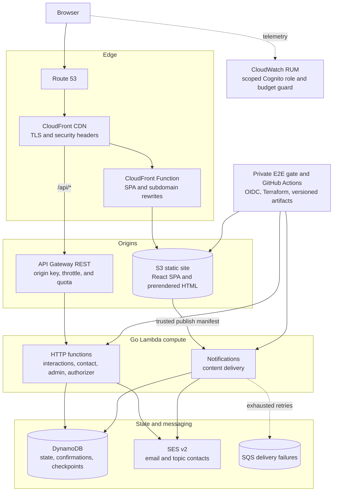

# Hi, I'm Jonathan 👋

I'm a Software Development Engineer II at Amazon with **10+ years of experience** across backend engineering,
cloud-native infrastructure, and developer automation. I enjoy building reliable systems, understanding how they fail,
and turning what I learn into practical tools and clear documentation.

You can find my writing, projects, and interactive experiments at **[jyates.dev](https://jyates.dev)**.

---

## 🛠️ Tech Stack & Interests

| Domain | Tools & Topics |
| --- | --- |
| **Languages** | Java, Go, Python, TypeScript/JavaScript, C/C++ |
| **Cloud / Platform** | AWS, Kubernetes (K3s & EKS), Terraform, Flux CD, Ansible, GitHub Actions |
| **Distributed Systems** | Microservices, event-driven architecture, system design, DynamoDB |
| **AI / Applied ML** | Agentic workflows, MCP, A2A, local inference, embeddings |
| **Observability** | OpenTelemetry, CloudWatch, Prometheus, Grafana, Loki |
| **Systems & Networks** | Proxmox, OPNsense, MetalLB, Traefik, BIND9 |
| **Data** | DynamoDB, PostgreSQL, Redis |

---

## 🔭 What I'm Building

### [`bityllm`](https://github.com/jyatesdotdev/bityllm)

A tiny language model written in pure TypeScript: trained from scratch, dependency-free, and running entirely in the
browser as an interactive terminal dream sequence.

### [`nexus`](https://github.com/jyatesdotdev/nexus)

An educational multi-agent orchestration lab built around Google ADK, A2A, and MCP, with agent discovery,
reviewer-critic workflows, and distributed tracing.

### [`npu-embeddings`](https://github.com/jyatesdotdev/npu-embeddings)

An OpenAI-compatible embeddings service that runs `all-MiniLM-L6-v2` on the AMD XDNA NPU in Strix Halo hardware.

### [Comprehensive project templates](https://github.com/jyatesdotdev?tab=repositories&q=comprehensive-template)

Production-minded starter repositories for Go, Rust, Python, TypeScript, C, C++, Java, and Swift, each with testing,
security scanning, CLI examples, and container support appropriate to its ecosystem.

---

## 🌐 How jyates.dev Works

[jyates.dev](https://jyates.dev) is a serverless portfolio, MDX blog, and browser playground on AWS. Alongside the
usual career, project, library, and contact pages, it includes likes and comments, confirmed content subscriptions,
RSS, a visitor map, and a browser-only `jsh` terminal. The interactive tools run in independent draggable windows,
including a few deliberately nostalgic under-construction experiments.

**A few design decisions behind it:**

- **Static-first React** — React 19 and React Router 8 prerender known routes for S3 while preserving client-side
  navigation. The build also generates RSS, sitemap, robots, and local PlantUML assets from MDX content.
- **Purpose-scoped identity** — anonymous browser visitor IDs deduplicate likes without using IP addresses as account
  identifiers. Coarse edge geography powers aggregated visitor statistics.
- **Confirmed updates** — readers explicitly choose blog and project topics, confirm through a single-use email link,
  and receive notifications only after a deployment is verified. DynamoDB checkpoints make delivery resumable.
- **Release gates before mutation** — frontend and API deploy workflows test exact frontend, API, and integration
  revisions together in LocalStack before assuming an AWS role through GitHub OIDC. No static cloud credentials are
  used.
- **Cost-aware observability** — RUM, encrypted logs, X-Ray, dashboards, throttles, and application write limits provide
  useful production signals while a budget action can disable RUM ingestion at its monthly limit.

The system is split across three public implementation repositories and two private operational repositories:

| Repository | Visibility | Responsibility |
| --- | --- | --- |
| [`jyatesdotdev-frontend`](https://github.com/jyatesdotdev/jyatesdotdev-frontend) | Public | React SPA, MDX content, browser tools, and static deployment |
| [`jyatesdotdev-api`](https://github.com/jyatesdotdev/jyatesdotdev-api) | Public | Go Lambda handlers, services, persistence, and email delivery |
| [`jyatesdotdev-infra`](https://github.com/jyatesdotdev/jyatesdotdev-infra) | Public | Terraform for AWS infrastructure, DNS, security, and observability |
| `jyatesdotdev-integration` | Private | Cross-repository Playwright and LocalStack release gate |
| Bootstrap repository | Private | Account-level OIDC, deployment role, artifact bucket, and Terraform state |

---

## 📚 Learning & Sharing

I write about the useful parts of the work, including the wrong turns. Current areas of exploration include distributed
systems and agent protocols, local AI acceleration, production security and cost trade-offs, and low-level hardware
investigation. Recent notes and deep dives live on the **[jyates.dev blog](https://jyates.dev/blog)**.

## 💬 Get in Touch

The best places to reach me are the **[contact form](https://jyates.dev/contact)** or
**[LinkedIn](https://www.linkedin.com/in/jyatesdotdev/)**. Project-specific questions and contributions are welcome in
the relevant repository.

---

> *"Spot the bottleneck, learn fast, ship the fix."*
